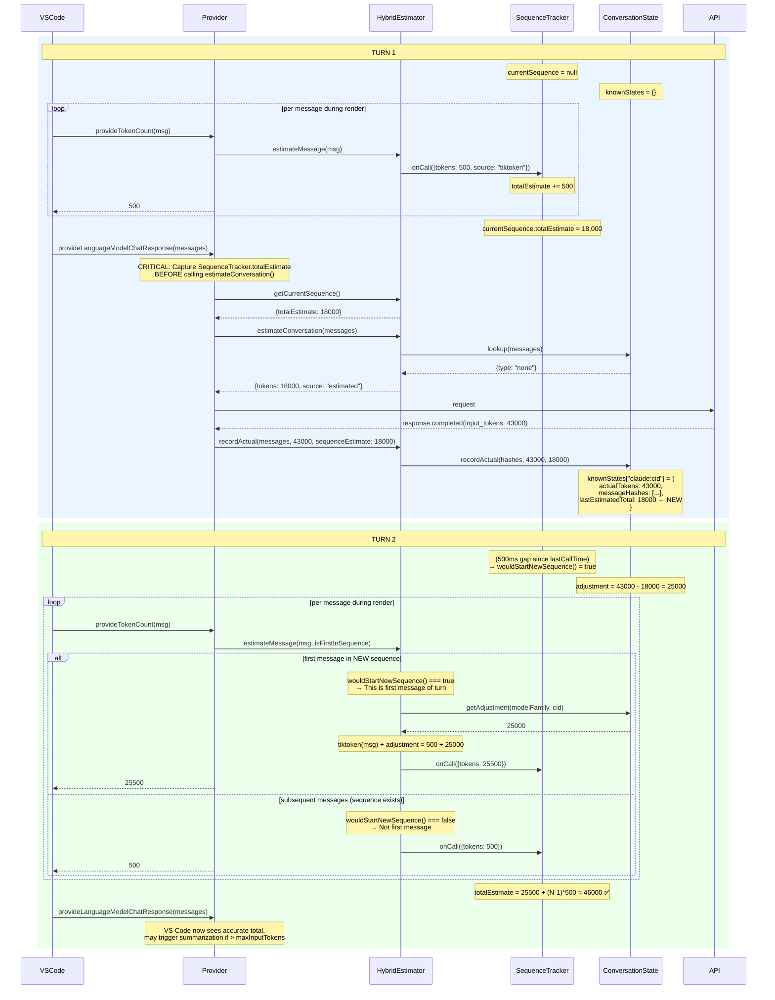

# RFC 00047: Rolling Correction for provideTokenCount

**Status:** Idea  
**Priority:** High  
**Author:** Copilot  
**Created:** 2026-02-05

**Depends On:** 029 (Delta-Based Token Estimation)  
**Related:** 044 (Gateway vs VS Code Token Limit Mismatch)

## Summary

VS Code's `provideTokenCount()` API is called per-message during render, but our delta estimation only works at the conversation level. This creates a gap where VS Code sees tiktoken estimates (~65k) while actual API usage is much higher (~108k), preventing summarization from triggering.

This RFC proposes a **rolling correction** mechanism that applies the measured estimation error from the previous turn to the current turn's per-message estimates.

## The Gap

RFC 029 implemented delta estimation for `estimateConversation()`:

```
knownActual + tiktoken(newMessages) = accurate total
```

But VS Code doesn't call `estimateConversation()`. It calls `provideTokenCount()` **per-message** during render, then sums the results:

| Phase     | Method                       | What We Return              | What We Know              |
| --------- | ---------------------------- | --------------------------- | ------------------------- |
| Render    | `provideTokenCount(msg)` × N | tiktoken(msg)               | knownActual from Turn N-1 |
| Preflight | `estimateConversation(msgs)` | knownActual + tiktoken(new) | ✅ Accurate               |

**Result**: VS Code sees ~65k (sum of tiktoken), decides not to summarize, but actual API usage is ~108k.

## Empirical Evidence

From production logs:

| Messages | Tiktoken Estimate | Actual (API) | Ratio |
| -------- | ----------------- | ------------ | ----- |
| 216      | 71,605            | 109,148      | 1.52x |
| 21       | 17,660            | 43,096       | 2.44x |
| 214      | 69,683            | 109,175      | 1.57x |
| 218      | 70,041            | 109,747      | 1.57x |

The ratio varies from 1.5x to 2.5x — a fixed multiplier cannot correct this accurately.

## Sequence Diagram



## Key Insight: Estimate Source Must Be SequenceTracker

The estimate we store in `lastEstimatedTotal` **must come from `SequenceTracker.totalEstimate`**, not from `estimateConversation()`.

**Why?** Because `SequenceTracker.totalEstimate` is exactly what VS Code saw — the sum of all `provideTokenCount()` returns. If we stored the result of `estimateConversation()` instead, we'd be comparing apples to oranges:

| Source                          | What It Represents                                      |
| ------------------------------- | ------------------------------------------------------- |
| `SequenceTracker.totalEstimate` | Sum of `provideTokenCount()` returns (what VS Code saw) |
| `estimateConversation()` result | Delta estimation (may use known actual for prefix)      |

The adjustment formula requires the **same basis** for both terms:

```
adjustment = actualTokens - whatVSCodeSaw
           = actualTokens - SequenceTracker.totalEstimate
```

## The Algorithm

### Rolling Correction Formula

```
adjustment[turn N] = actualTokens[turn N-1] - sequenceEstimate[turn N-1]
```

Where `sequenceEstimate` is `SequenceTracker.getCurrentSequence().totalEstimate` captured at API call time.

### First Message Detection

We detect "first message in turn" using `wouldStartNewSequence()` — a predictive method that checks the same condition `onCall()` uses without side effects:

```typescript
// In estimateMessage():
const isFirstInSequence = this.sequenceTracker.wouldStartNewSequence();

if (isFirstInSequence) {
  const adjustment = this.getAdjustment(modelFamily, conversationId);
  // Apply adjustment to this message
}

// Then record the call (which may create a new sequence)
this.sequenceTracker.onCall({...});
```

**Why `wouldStartNewSequence()` instead of `getCurrentSequence() === null`**: Gap detection happens _inside_ `onCall()`, not before it. After a 500ms gap, `getCurrentSequence()` still returns the **old** sequence (not null) — it only gets replaced when `onCall()` runs. The `wouldStartNewSequence()` method checks the same condition (`!currentSequence || gap > SEQUENCE_GAP`) without mutating state, making it safe to call before `onCall()`.

> **H5 Refutation (2026-02-05)**: This was discovered during verification. The original RFC proposed `getCurrentSequence() === null`, which was proven incorrect by test — see [Appendix: Verification Notes](#appendix-verification-notes).

### Telescoping Property

The sum of all `provideTokenCount` calls equals:

```
sum(tiktoken(all messages)) + adjustment
= sequenceEstimate[N] + (actualTotal[N-1] - sequenceEstimate[N-1])
= actualTotal[N-1] + tiktoken(new messages)
```

This is exactly the delta estimation formula from RFC 029, distributed across per-message calls.

## Data Model Changes

### KnownConversationState

```typescript
interface KnownConversationState {
  messageHashes: string[];
  actualTokens: number;
  modelFamily: string;
  timestamp: number;

  // NEW: What SequenceTracker.totalEstimate was when we recorded actual
  lastSequenceEstimate?: number;
}
```

**Note**: Named `lastSequenceEstimate` (not `lastEstimatedTotal`) to be explicit about the source.

### Updated recordActual() Signature

```typescript
recordActual(
  messages: readonly vscode.LanguageModelChatMessage[],
  modelFamily: string,
  actualTokens: number,
  conversationId?: string,
  sequenceEstimate?: number,  // NEW: from SequenceTracker
): void
```

### New Method: getAdjustment()

```typescript
class HybridTokenEstimator {
  /**
   * Get the correction adjustment for the current conversation.
   * Returns 0 if no prior state or if this is the first turn.
   */
  getAdjustment(modelFamily: string, conversationId?: string): number {
    const state = this.conversationTracker.getState(
      modelFamily,
      conversationId,
    );
    if (!state || state.lastSequenceEstimate === undefined) {
      return 0;
    }
    return Math.max(0, state.actualTokens - state.lastSequenceEstimate);
  }
}
```

## Implementation Plan

### Phase 1: Capture Sequence Estimate at API Call Time

**Goal**: Store what VS Code saw (SequenceTracker total) alongside actual tokens.

1. **Add `lastSequenceEstimate` to `KnownConversationState`**
   - File: `conversation-state.ts`
   - Add optional field to interface
   - Update persistence schema version

2. **Update `recordActual()` to accept sequence estimate**
   - File: `hybrid-estimator.ts`
   - Add `sequenceEstimate?: number` parameter
   - Pass through to `conversationTracker.recordActual()`

3. **Capture sequence estimate in provider before API call**
   - File: `provider.ts`
   - In `provideLanguageModelChatResponse()`, before calling API:
     ```typescript
     const sequenceEstimate =
       this.tokenEstimator.getCurrentSequence()?.totalEstimate;
     ```
   - Pass to `recordActual()` after API response

### Phase 2: Apply Adjustment to First Message

**Goal**: Make VS Code see corrected totals.

1. **Add `getAdjustment()` to `HybridTokenEstimator`**
   - File: `hybrid-estimator.ts`
   - Implement as shown above

2. **Detect first message in `estimateMessage()`**
   - Call `wouldStartNewSequence()` BEFORE calling `onCall()`
   - If first message, get adjustment and add to estimate

3. **Update `provideTokenCount()` to pass context**
   - File: `provider.ts`
   - Pass `modelFamily` and `conversationId` to `estimateMessage()`
   - (May need to extract capsule earlier in the flow)

### Phase 3: Testing & Validation

1. **Unit tests for adjustment calculation**
   - Test `getAdjustment()` returns correct value
   - Test first-message detection via sequence tracker
   - Test adjustment is only applied once per turn

2. **Integration test: verify VS Code sees corrected totals**
   - Mock sequence of `provideTokenCount()` calls
   - Verify sum equals `previousActual + tiktoken(new)`

3. **Log analysis**
   - Add logging for adjustment application
   - Verify in production that adjustment matches actual error

## Interaction with Existing Mechanisms

### learnedTokenTotal (1.5x multiplier)

The existing `learnedTokenTotal` mechanism:

- Activates only after "input too long" errors
- Applies a fixed 1.5x multiplier
- Is a **reactive** last-resort recovery

Rolling correction:

- Activates after every successful API response
- Applies the **actual measured error**
- Is **proactive** accuracy improvement

**Recommendation**: Keep both. Rolling correction handles normal operation; `learnedTokenTotal` handles error recovery.

### SequenceTracker

Already tracks:

- `totalEstimate` (running sum of `provideTokenCount` calls)
- Turn boundaries (500ms gap since `lastCallTime`)
- `wouldStartNewSequence()` (predictive check without side effects)

We'll use:

- `totalEstimate` as `lastSequenceEstimate` when recording actual
- `wouldStartNewSequence()` to detect first message in turn

### ConversationStateTracker

Already provides:

- `recordActual()` for storing known states
- `lookup()` for delta estimation
- `getState()` for retrieving known state

We'll add:

- `lastSequenceEstimate` field to stored state
- `getAdjustment()` method (or compute in HybridEstimator)

## Success Criteria

1. **VS Code sees accurate totals**: Sum of `provideTokenCount` ≈ actual API usage
2. **Summarization triggers appropriately**: At ~85% of `maxInputTokens`
3. **No over-correction**: Adjustment is bounded to actual measured error
4. **Graceful degradation**: First turn uses pure tiktoken (no prior data)

## Risks & Mitigations

| Risk                                       | Mitigation                                      |
| ------------------------------------------ | ----------------------------------------------- |
| Adjustment applied to wrong conversation   | Key by `conversationId` (from capsule)          |
| Stale adjustment after conversation change | Clear on conversation hash mismatch             |
| Over-correction on first message           | Cap adjustment at reasonable bound (e.g., 100k) |
| SequenceTracker gap detection fails        | Falls back to pure tiktoken (current behavior)  |
| Sequence estimate captured at wrong time   | Capture BEFORE `estimateConversation()` call    |

## Alternatives Considered

### 1. Fixed Multiplier (Current Approach)

Apply 1.5x to all estimates. But:

- Ratio varies 1.5x to 2.5x in practice
- Either under-corrects or over-corrects
- Doesn't adapt to actual error

### 2. Per-Message Caching

Cache actual tokens per message. But:

- API only returns totals, not per-message breakdown
- Would need to distribute proportionally (imprecise)
- More complex storage

### 3. Conversation-Level Override

Return `knownActual / messageCount` for each message. But:

- Requires knowing message count upfront
- Doesn't handle new messages correctly
- Loses per-message granularity

### 4. Use estimateConversation() Result as Baseline

Store `estimateConversation()` result instead of `SequenceTracker.totalEstimate`. But:

- `estimateConversation()` may use delta estimation (known + tiktoken)
- This would compare different estimation strategies
- We need to compare what VS Code saw vs what API reported

## Appendix: Verification Notes

_Added 2026-02-05. Documents the verification steps taken during RFC development._

### What We Verified (Internal Consistency)

**1. H5 Refutation: `getCurrentSequence() === null` does NOT work**

The original RFC proposed detecting first-message-in-turn by checking `getCurrentSequence() === null`. This was proven **wrong** by tests in `sequence-tracker.test.ts` (H5 verification suite):

- After a 501ms gap, `getCurrentSequence()` still returns the **old** sequence object (not null)
- Gap detection happens _inside_ `onCall()`, which replaces the old sequence — but only after it runs
- Therefore, checking `=== null` before `onCall()` always returns `false` after the first turn

**2. `wouldStartNewSequence()` correctly predicts `onCall()` behavior**

The replacement method `wouldStartNewSequence()` was verified with 7 formal proof tests in `sequence-tracker-proof.test.ts`:

| Proof | Scenario                            | Result                                        |
| ----- | ----------------------------------- | --------------------------------------------- |
| 1     | No sequence exists                  | Both agree: new sequence                      |
| 2     | Immediately after a call (0ms gap)  | Both agree: same sequence                     |
| 3     | At exactly 500ms boundary           | Both agree: same sequence (uses `>` not `>=`) |
| 4     | At 501ms                            | Both agree: new sequence                      |
| 5     | After reset()                       | Both agree: new sequence                      |
| 6     | 100 random scenarios (0-999ms gaps) | **Zero mismatches**                           |
| 7     | Full RFC 045 usage pattern          | Works correctly end-to-end                    |

**3. TOCTOU limitation acknowledged**

There is a theoretical window between calling `wouldStartNewSequence()` and `onCall()` where the system clock advances. In practice, this is negligible because both calls happen in the same synchronous function body, separated by a few microseconds against a 500ms threshold.

### What We Assume (External Behavior)

> **Critical caveat**: Our proof tests verify that `wouldStartNewSequence()` predicts `onCall()` correctly — they verify _internal consistency_ of the `CallSequenceTracker`. They do **not** independently verify that our model of VS Code's behavior is correct.

The RFC relies on three assumptions about how the Copilot extension (the chat participant) uses the VS Code Language Model API:

**A1: Per-message calling pattern** — The Copilot extension calls `model.countTokens()` once per message in a loop, and our `provideTokenCount()` receives those calls.

- _Evidence_: **Production logs** show sequences of 134–289 rapid `provideTokenCount` calls, matching expected message counts. Example from `.logs/previous.log`:
  ```
  [2026-02-04T20:25:12] New sequence started (gap: 13068ms, previous: 147 calls, 48738 tokens)
  [2026-02-04T20:26:11] New sequence started (gap: 6723ms, previous: 289 calls, 113114 tokens)
  [2026-02-04T20:26:18] New sequence started (gap: 6720ms, previous: 138 calls, 62150 tokens)
  ```
- _VS Code source_: Core VS Code provides `countTokens()` as a single-message API on `LanguageModelChat`. There are **no** per-message loops in VS Code core — the looping happens in the **Copilot extension** (closed source, not inspectable).
- _Confidence_: **High** — production logs conclusively demonstrate the per-message pattern.

**A2: Token sums influence summarization** — The Copilot extension sums the per-message token counts and uses that total to decide whether to summarize the conversation.

- _Evidence_: VS Code core uses `maxInputTokens` only for **UI display** (context usage widget showing percentage). The actual summarization decision is made by the Copilot extension, whose source is not available.
- _Circumstantial evidence_: Our empirical data shows VS Code does _not_ summarize when tiktoken estimates are ~65k but actual usage is ~108k, suggesting the summed estimates are being compared to a threshold.
- _Confidence_: **Medium** — consistent with observed behavior but not directly confirmed by source.

**A3: 500ms gap correctly identifies turn boundaries** — The time gap between the last `provideTokenCount` call of one turn and the first call of the next turn is always >500ms.

- _Evidence_: Production logs show inter-turn gaps ranging from 1,824ms to 84,494ms — all well above 500ms. Intra-turn calls happen near-simultaneously (sub-millisecond gaps).
- _Confidence_: **High** — 500ms is extremely conservative; real gaps are 2-85 seconds.

### How We Concluded the Calling Pattern

The chain of evidence:

1. **API contract**: VS Code's `LanguageModelChatProvider` interface requires implementing `provideTokenCount(model, text | message, token)` — a single-message API.

2. **Production observation**: Our `CallSequenceTracker.onCall()` logs every call. We observe bursts of 100-300 calls within milliseconds, separated by multi-second gaps. This is consistent with a loop iterating over conversation messages.

3. **VS Code source audit**: Examination of the VS Code source (`.reference/vscode/`) confirms that `countTokens()` is plumbing — it delegates to `provideTokenCount()` for a single value. VS Code core does not loop over messages itself.

4. **Inference**: Since VS Code core doesn't loop, and we observe looping behavior, the loop must be in the **Copilot extension** (the chat participant that calls `model.countTokens()` for each message before sending via `model.sendRequest()`).

5. **Robustness**: Even if the exact caller changes, our algorithm only depends on the _observable behavior_ — rapid bursts of `provideTokenCount()` calls with gaps between turns. As long as that pattern holds, the rolling correction works correctly.

## Appendix: Key Alignment & Summarization Invalidation

_Added 2026-02-05. Documents findings from post-Phase-3 recon audit._

### Finding: Rolling Correction Is Currently Inert

During Phase 2 implementation, `provideTokenCount()` passes `undefined` as `conversationId` to `estimateMessage()` (Phase 2 item 3 noted this gap: "May need to extract capsule earlier in the flow"). Meanwhile, `recordActual()` in `provideLanguageModelChatResponse()` stores state under a per-conversation key derived from the first user message hash.

| Code Path                                               | `conversationId`    | State Key         |
| ------------------------------------------------------- | ------------------- | ----------------- |
| `provideTokenCount()` → `getAdjustment()`               | `undefined`         | `"claude"`        |
| `provideLanguageModelChatResponse()` → `recordActual()` | first-user-msg hash | `"claude:<hash>"` |

**Result**: `getAdjustment()` always returns 0 in production because it reads from a key that `recordActual()` never writes to.

### Finding: Repeated Summarization Has a Different Root Cause

The original hypothesis — that stale rolling correction causes repeated summarization — is **refuted**. The correction never fires. The repeated summarization is likely caused by the `learnedTokenTotal` 1.5x multiplier mechanism, which has its own invalidation logic but may not clear fast enough after summarization.

### Fix: Key Alignment (Phase 4a)

Two approaches, in order of preference:

**Option A: Write model-family-only state alongside per-conversation state.**
`recordActual()` writes to both `"claude:<hash>"` (for delta estimation) and `"claude"` (for rolling correction). `getAdjustment()` reads from `"claude"`. Simple, no changes to `provideTokenCount()`.

**Option B: Pass conversationId into `provideTokenCount()`.**
Requires extracting the conversation context earlier in the provider flow. More invasive but more precise.

### Fix: Post-Summarization Invalidation (Phase 4b)

Once rolling correction is active, a stale adjustment after summarization would cause the exact repeated-summarization problem originally hypothesized. The `lookup()` method already detects conversation divergence (returns `"none"` when message hashes don't form a prefix). The fix:

In `getAdjustment()`, validate that the stored state is still relevant:

- If `actualTokens` in stored state is much larger than what the current sequence estimates suggest, the conversation was likely summarized
- Or: in `recordActual()`, detect when `newActual < previousActual` (conversation shrank) and clear `lastSequenceEstimate`

### Updated Implementation Plan

Phases 1–3 are complete. Remaining phases updated:

#### Phase 4a: Key Alignment (RFC 047)

1. **Write model-family-only adjustment state in `recordActual()`**
   - File: `conversation-state.ts`
   - When `conversationId` is provided, also write a model-family-only entry with just `actualTokens` and `lastSequenceEstimate`
   - `getAdjustment()` continues to read from model-family-only key

2. **Test: rolling correction activates end-to-end**
   - Verify `getAdjustment()` returns non-zero after `recordActual()` with conversationId

#### Phase 4b: Post-Summarization Invalidation (RFC 047)

_Updated 2026-02-05: Replaced token-drop heuristic with explicit `<conversation-summary>` tag detection._

**Discovery**: Copilot Chat inserts a `<conversation-summary>` XML tag as a **persistent user message** at the start of the messages array after summarization. This tag remains on all subsequent turns until replaced by a newer summary. This is a stable, reliable signal confirmed from the `vscode-copilot-chat` source code.

**Mechanism**: The summary is generated by `ConversationHistorySummarizationPrompt`, stored on `ChatConversation.summary`, and rendered as a `UserMessage` wrapping `<conversation-summary>...</conversation-summary>`. Prior history turns are dropped (cut off at the summary point). The summary contains structured `<analysis>` and `<summary>` sections.

**Identity implication**: Since `extractIdentity()` hashes the first user message, summarization naturally changes the conversation identity (the first user message is now the summary, not the original). This means:
- Per-conversation rolling correction state becomes orphaned (expires via TTL — correct behavior)
- The model-family-only key (Phase 4a dual-write) persists across identity resets
- The family-key correction may be stale after summarization and should be cleared

**Detection strategy** (ordered by reliability):
1. **Primary**: Scan messages in `provideLanguageModelChatResponse()` for `<conversation-summary>` tag in user message content
2. **Secondary**: Prefix-matching failure in `ConversationStateTracker.lookup()` (message digests don't match after summarization)
3. **Tertiary**: Token-count drop as a fallback heuristic (actual drops >20% or >1000 tokens)

**Implementation**:

1. **Add `<conversation-summary>` detection utility**
   - File: new utility or in `conversation-state.ts`
   - Scan user messages for `<conversation-summary>` tag
   - Return boolean + optionally extract summary content for logging

2. **Clear family-key adjustment on summarization detection**
   - In `recordActual()` or at the `provideLanguageModelChatResponse()` call site
   - When summary tag is detected, clear `lastSequenceEstimate` from the family-key state
   - This causes `getAdjustment()` to return 0 until a new estimate-vs-actual pair is established post-summarization

3. **Test: adjustment clears after simulated summarization**
   - Create messages with `<conversation-summary>` tag as first user message
   - Record actual, verify `getAdjustment()` returns 0
   - Verify adjustment re-establishes on subsequent non-summarized turns

## References

- [RFC 029: Delta-Based Token Estimation](../stage-3/029-hybrid-token-estimator.md)
- [RFC 044: Gateway vs VS Code Token Limit Mismatch](./00044-gateway-vs-vs-code-token-limit-mismatch.md)
- [VS Code LM API: provideTokenCount](https://code.visualstudio.com/api/references/vscode-api#LanguageModelChatProvider)
- [CallSequenceTracker](../../packages/vscode-ai-gateway/src/tokens/sequence-tracker.ts) - 500ms gap detection
- [ConversationStateTracker](../../packages/vscode-ai-gateway/src/tokens/conversation-state.ts) - Known state persistence
- [Proof tests](../../packages/vscode-ai-gateway/src/tokens/sequence-tracker-proof.test.ts) - Formal verification of wouldStartNewSequence()
- [H5 verification tests](../../packages/vscode-ai-gateway/src/tokens/sequence-tracker.test.ts) - H5 refutation suite
